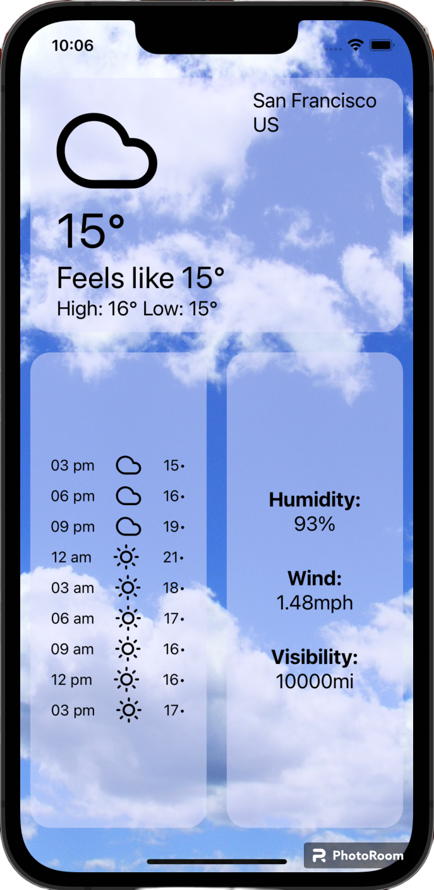
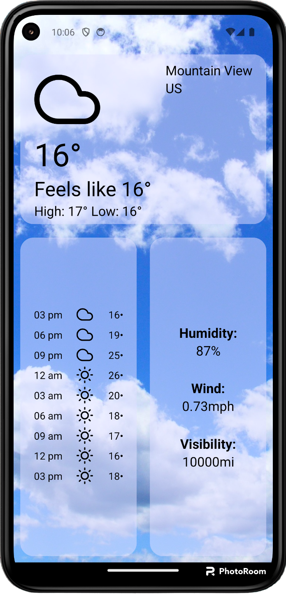

# Weather App

WeatherApp is a user-friendly weather app that provides you with real-time weather updates and 5-day forecasts with 3-hour intervals. Get accurate and detailed weather information for your current location. Stay prepared for any weather conditions and plan your day accordingly. 

<p align="center">
  
  
</p>

## Table of Contents

- [Project Description](#project-description)
- [Installation](#installation)
- [Usage](#usage)
- [Configuration](#configuration)
- [Acknowledgments](#acknowledgments)

## Project Description

The app offers a comprehensive set of features, including:

Current Weather: Get up-to-date information about the current weather conditions in your area.

5-Day Forecasts: Plan ahead with accurate 5-day forecasts, updated at 3-hour intervals.

Location-Based: WeatherApp automatically detects your current location, so you always get localized weather updates.


## Installation

Clone the repository: `git clone https://github.com/SadafAsad/WeatherApp.git`

Navigate to the project directory: `cd WeatherApp`

Install dependencies: `npm install`

Enter your API key in the .env file

## Usage

``` npm run ```

## Configuration

Initialize eslint: `npx eslint –init` 

Run lint using: `npm run lint`

Note: If you got any error in running stage, it might be due to the incompatibility between eslint and prettier.

Resolve with: `npm install --save-dev eslint-plugin-prettier@[version]`

## Acknowledgments

Thanks for providing inspiration and code snippets: 

[Weather App Demo](https://github.com/Em01/weather-app-demo) developed by [Em01](https://github.com/Em01)


